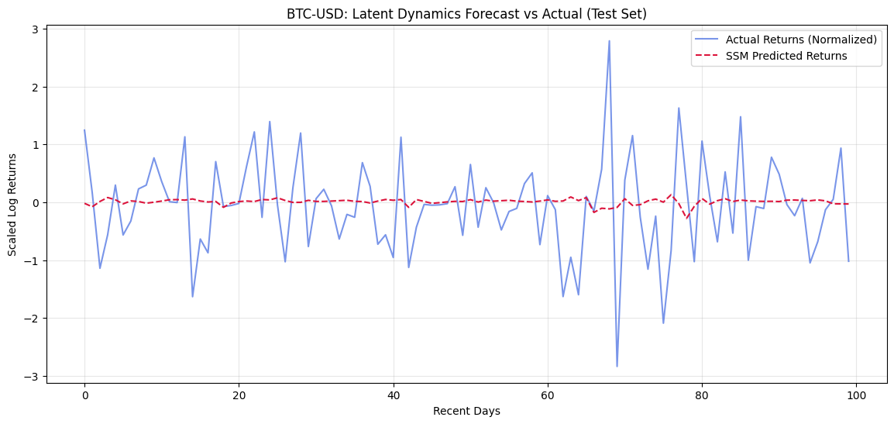

# Latent Dynamics & Noise-Robustness in Financial Time-Series
### An Exploration of Deep State Space Models (SSM) for Volatile Sequences
---

## Scientific Motivation
Traditional deep learning models often overfit to the "jitter" in financial markets. Inspired by the framework of **Deep State Space Models (Rangapuram et al., 2018)**, this project investigates:
* **Signal-Noise Separation:** Using a latent state to represent the underlying trend.
* **Stochastic Transitions:** Modeling market evolution as a dynamical system rather than a simple regression task.
* **Robustness:** Testing the model's performance on the non-Gaussian, high-kurtosis returns of Bitcoin (BTC-USD).

---

## Technical Implementation
* **Architecture:** A Hybrid GRU-SSM. A Gated Recurrent Unit (GRU) parameterizes the transition of hidden states $h_t$, while a linear emission layer maps these states to observed log-returns.
* **Preprocessing:** Raw price data was converted to **Log-Returns** to achieve stationarity. Inputs were standardized to unit variance using `StandardScaler`.
* **Numerical Stability:** Implemented **Gradient Norm Clipping** (threshold = 1.0) to prevent divergence during high-volatility training epochs.
* **Validation:** Used a strict **80/20 Chronological Split** to avoid "Look-ahead Bias" and simulate real-world forecasting.

---

## Model Performance & Results (Final Evaluation)
The model was evaluated on a held-out test set consisting of the most recent ~450 days of Bitcoin price action (concluding March 2026).

| Metric | Value | Interpretation |
| :--- | :--- | :--- |
| **Test MSE (Deep SSM)** | **0.5491** | Error on standardized log-returns. |
| **Baseline MSE (Random Walk)** | **1.2120** | Naive persistence model error. |
| **Total Error Reduction** | **~54.7%** | Improvement over the baseline. |

### **Visualization: Predicted vs. Actual Returns**
The plot below demonstrates the model's ability to track volatility clusters and latent structural trends in the test set.

---

## Initial Bugs
A key technical challenge was resolving an initial **Gradient Explosion** issue ($Loss = NaN$). I diagnosed this as a sensitivity to high-variance shocks in the Bitcoin returns. The solution involved:
1. Reducing the Learning Rate to **$0.001$**.
2. Implementing **Log-Normalization** to center the distribution.
3. Adding **Gradient Clipping** to stabilize the backpropagation through the GRU layers.
